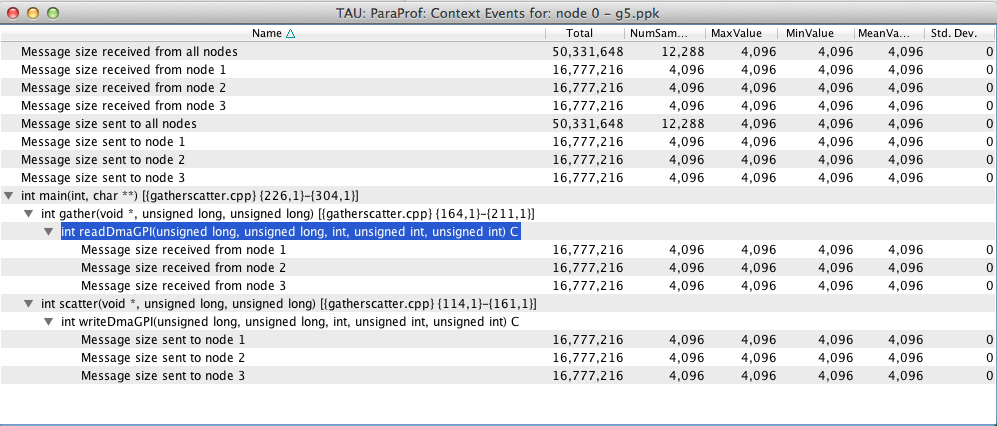

Installation
============

TAU (Tuning and Analysis Utilities) is a portable profiling and tracing
toolkit for performance analysis of parallel programs written in
Fortran, C++, C, Java and Python. The model that TAU uses to profile
parallel, multi-threaded programs maintains performance data for each
thread, context, and node in use by an application. The profiling
instrumentation needed to implement the model captures data for
functions, methods, basic blocks, and statement execution at these
levels. All C++ language features are supported in the TAU profiling
instrumentation including templates and namespaces, which is available
through an API at the library or application level. The API also
provides selection of profiling groups for organizing and controlling
instrumentation. The instrumentation can be inserted in the source code
using an automatic instrumentor tool based on the Program Database
Toolkit (PDT), dynamically using DyninstAPI, at runtime in the Java
virtual machine, or manually using the instrumentation API. TAU's
profile visualization tool, paraprof, provides graphical displays of all
the performance analysis results, in aggregate and single
node/context/thread forms. The user can quickly identify sources of
performance bottlenecks in the application using the graphical
interface. In addition, TAU can generate event traces that can be
displayed with the Vampir or Paraver trace visualization tools. This
chapter discusses installation of the TAU portable profiling package.

Some tau options allow external resources to be automatically downloaded
and built when TAU is configured. To obtain these resources in a single
package download http://tau.uoregon.edu/ext.tgz and unpack it in TAU's
root directory. When you configure TAU with:

-  ``
                   -bfd=download
                   ``

-  ``
                   -unwind=download
                   ``

-  ``
                   -ompt=download
                   ``

these packages will be provided by the ext.tgz package and no additional
network activity will be required.

Installing TAU
==============

Know what options you will need
-------------------------------

Each TAU configuration results in a single ``Makefile``. These
``Makefiles`` denote the configuration that produced it and is used by
the user to select the TAU libraries/scripts associated with its
configuration. (These makefiles are named after the configuration
options, ie. TAU configured with MPI, PDT, PGI compilers and the
'-nocomm' option is named: ``Makefile.tau-nocomm-mpi-pdt-pgi``). On most
machines several configuration of TAU will need to be built in order to
take full advantage of the many features of TAU. This section should
help you decide on the smallest set of configuration you will need to
build.

The options used to configure TAU can be grouped into two categories:

-  External packages: TAU will use these when instrumenting or measuring
   an application. *Configuring with these options does not force the
   user to use these packages*, ie: configuring with PDT does not force
   the user to use source code based instrumentation (they can use
   compiler based instrumentation instead). Similarly configuring with
   PAPI does not forces the user to select any PAPI counters when
   profiling.

       **Note**

       The only exception is configuring with the epilog (scalasca)
       tracing package. This will replace the TAU tracer with the epliog
       one, a single configuration cannot use both tracers.

   For this reason it is recommend that you *configure with every
   external packages that the user might be interested in using*,
   letting them choose which packages to enable when they go to
   instrument or measure their application.

-  Compiler and MPI options: these control the behavior of TAU when it
   compiles the instrumented application. TAU provides compiler wrapper
   scripts, these options control which compiler TAU will wrap, *These
   options are determinative: select only options that are compatible.*
   For example, when configuring with MPI use a version of MPI
   compatible with the compiler you select.

   Since multiple compiler/MPI libraries cannot be specified for a
   single configuration, *each set of compiler/MPI libraries that you
   want to use with TAU need to be configured separately.*

       **Note**

       Configurations with different compilers are given separate
       ``Makefiles`` automatically, however configurations with
       different MPI implementations are not. Use the ``-tag=`` option
       to distinguish between different MPIs, ie: ``-tag=mvapich`` or
       ``-tag=openmpi``.

The ``configure`` shell script attempts to guess correct values for
various system-dependent variables used during compilation (compilers
and system architecture), other options need to be specified on the
command line.

The following are the most important command-line options are available
to configure:

Common configuration options
----------------------------

Select compiler
~~~~~~~~~~~~~~~

TAU defaults to using any compilers found in the environment. To use a
specific compiler use these options:

-  ``-c++=<C++ compiler>``

   Specifies the name of the C++ compiler. Supported C++ compilers
   include KCC (from KAI/Intel), CC (SGI, Sun), g++ (from GNU), FCC
   (from Fujitsu), xlC (from IBM), guidec++ (from KAI/Intel), cxx
   (Tru64) and aCC (from HP), c++ (from Apple), icpc and ecpc (from
   Intel) and pgCC (from PGI).

-  ``-cc=<C Compiler>``

   Specifies the name of the C compiler. Supported C compilers include
   cc, gcc (from GNU), pgcc (from PGI), fcc (from Fujitsu), xlc (from
   IBM), and KCC (from KAI/ Intel), icc and ecc (from Intel).

-  ``-fortran=<Fortran Compiler>``

   Specifies the name of the Fortran90 compiler. Valid options are: gnu,
   sgi, ibm, ibm64, intel, cray, pgi, absoft, fujitsu, sun, kai, nec,
   hitachi, compaq, nagware, g95 and hp.

Using MPI
~~~~~~~~~

To profile a program that use MPI configure TAU with these options:

-  ``-mpi``

   With this option, TAU will try to guess the location of the MPI
   libraries if the mpirun command is in your path. This does not always
   work in which case use these more detailed options:

-  ``-mpiinc=<dir>``

   Specifies the directory where MPI header files reside (such as mpi.h
   and mpif.h). This option also generates the TAU MPI wrapper library
   that instruments MPI routines using the MPI Profiling Interface. See
   the examples/NPB2.3/config/make.def file for its usage with Fortran
   and MPI programs. `MPI <http://www-unix.mcs.anl.gov/mpi/>`__

-  ``-mpilib=<dir>``

   Specifies the directory where MPI library files reside. This option
   should be used in conjunction with the -mpiinc=<dir> option to
   generate the TAU MPI wrapper library.

-  ``-mpilibrary=<lib>``

   Specifies the use of a different MPI library. By default, TAU uses
   -lmpi or -lmpich as the MPI library. This option allows the user to
   specify another library. e.g., -mpilibrary=-lmpi\_r for specifying a
   thread-safe MPI library.

OpenMP
~~~~~~

To profile programs using openmp use -openm and either OPARI option:

-  ``-openmp``

   Specifies OpenMP as the threads package to be used. `Open
   MPI <http://www.open-mpi.org/>`__

-  ``-opari``

   The use of Opari2 source-to-source instrumentor in conjunction with
   TAU exposes OpenMP events for instrumentation. See examples/opari
   directory. `OPARI <ihttp://www.vi-hps.org/projects/score-p/>`__

-  ``-opari1``

   Use this option for the use of the original Opari. Only use this
   option if -opari fails.
   `OPARI <http://www.fz-juelich.de/zam/kojak/opari/>`__

Configuring with external packages
----------------------------------

-  ``-pdt=<directory>``

   Specifies the location of the installed PDT (Program Database
   Toolkit) root directory. PDT is used to build tau\_instrumentor, a
   C++, C and F90 instrumentation program that automatically inserts TAU
   annotations in the source code
   `PDT <http://www.cs.uoregon.edu/research/pdt>`__. If PDT is
   configured with a subdirectory option (-compdir=<opt>) then TAU can
   be configured with the same option.

-  ``-pdt_c++=<C++ Compiler>``

   Specifies a different C++ compiler for PDT (tau\_instrumentor). This
   is typically used when the library is compiled with a C++ compiler
   (specified with -c++) and the tau\_instrumentor is compiled with a
   different <pdt\_c++> compiler. For e.g.,

   ::

       -arch=craycnl -pdt=/usr/pdtoolkit-3.17 -pdt_c++=g++ ...

   uses g++ to compile the tau\_instrumentor, for example on CRAY XT5
   systems use this option to build TAU any of the backend compilers.

   ::

       -arch=bgp -pdt=/usr/pdtoolkit-3.17 -pdt_c++=xlC -mpi

   uses PDT, MPI for IBM BG/P and specifies the use of the front-end xlC
   compiler for building tau\_instrumentor.

-  ``-papi=<directory>``

   Specifies the location of the installed PAPI (Performance Data
   Standard and API) root directory. PCL provides a common interface to
   access hardware performance counters and timers on modern
   microprocessors. Most modern CPUs provide on-chip hardware
   performance counters that can record several events such as the
   number of instructions issued, floating point operations performed,
   the number of primary and secondary data and instruction cache
   misses. To measure floating point instructions, set the environment
   variable TAU\_METRICS to PAPI\_FP\_INS (for example). This option (by
   default) specifies the use of hardware performance counters for
   profiling (instead of time). `PAPI <http://icl.cs.utk.edu/papi/>`__

-  ``-epilog=<dir>``

   Specifies the directory where the EPILOG tracing package
   `EPILOG <http://www.fz-juelich.de/zam/kojak/epilog/>`__ is
   installed.This option should be used in conjunction with the -TRACE
   option to generate binary EPILOG traces (instead of binary TAU
   traces). EPILOG traces can then be used with other tools such as
   EXPERT. EPILOG comes with its own implementation of the MPI wrapper
   library and the POMP library used with Opari. Using option overrides
   TAU's libraries for MPI, and OpenMP.

-  ``-otf=<directory>``

   Specifies the location of the OTF trace libraries generation package.
   TAU's binary traces can be converted to the OTF format using tau2otf,
   a tool that links with the OTF library.

-  ``-vtf=<directory>``

   Specifies the location of the VTF3 trace generation package. TAU's
   binary traces can be converted to the VTF3 format using tau2vtf, a
   tool that links with the VTF3 library. The VTF3 format is read by
   Intel trace analyzer, formerly known as vampir, a commercial trace
   visualization tool developed by TU. Dresden, Germany.

More configuration options
--------------------------

-  ``-PROFILEPHASE``

   This option generates phase based profiles. It requires special
   instrumentation to mark phases in an application (I/O, computation,
   etc.). Phases can be static or dynamic (different phases for each
   loop iteration, for instance). See examples/phase/README for further
   information.

-  ``-prefix=<directory>``

   Specifies the destination directory where the header, library and
   binary files are copied. By default, these are copied to
   subdirectories <arch>/bin and <arch>/lib in the TAU root directory.

-  ``-arch=<architecture>``

   Specifies the architecture. If the user does not specify this option,
   configure determines the architecture. For IBM BGL, the user should
   specify bgl as the architecture. For SGI, the user can specify either
   of sgi32, sgin32 or sgi64 for 32, n32 or 64 bit compilation modes
   respectively. The files are installed in the <architecture>/bin and
   <architecture>/lib directories. Cray options are xt3, craycnl or
   crayxmt.

-  ``-tag=<Unique Name>``

   Specifies a tag in the name of the stub Makefile and TAU makefiles to
   uniquely identify the installation. This is useful when more than one
   MPI library may be used with different versions of compilers. e.g.,

   ::

        
       % configure -c++=icpc -cc=icc -tag=intel71-vmi   \ 
                   -mpiinc=/vmi2/mpich/include
           

-  ``-scalasca=<dir>``

   Specifies the directory where the
   `SCALASCA <http://www.sclasca.org>`__ package is installed.

-  ``-pthread``

   Specifies pthread as the thread package to be used. In the default
   mode, no thread package is used.

-  ``-opari_region``

   Report performance data for only OpenMP regions and not constructs.
   By default, both regions and constructs are profiled with Opari.

-  ``-opari_construct``

   Report performance data for only OpenMP constructs and not Regions.
   By default, both regions and constructs are profiled with Opari.

-  ``-pdtarch=<architecture>``

   Specifies the architecture used to build pdt, default the tau
   architecture.

-  ``-papithreads``

   Same as papi, except uses threads to highlight how hardware
   performance counters may be used in a multi-threaded application.
   When it is used with PAPI, TAU should be configured with -papi=<dir>
   -pthread autoinstrument Shows the use of Program Database Toolkit
   (PDT) for automating the insertion of TAU macros in the source code.
   It requires configuring TAU with the -pdt=<dir> option. The Makefile
   is modified to illustrate the use of a source to source translator
   (tau\_instrumentor).

-  ``-jdk=<directory>``

   Specifies the location of the installed Java root directory. TAU can
   profile or trace Java applications without any modifications to the
   source code, byte-code or the Java virtual machine. See README.JAVA
   on instructions on using TAU with Java 2 applications. Also the
   refence guide has more information on the new tau\_java tool. This
   option should only be used for configuring TAU to use JVMTI for
   profiling and tracing of Java applications. It should not be used for
   configuring paraprof, which uses Java from the user's path.

-  ``-dyninst=<dir>``

   Specifies the directory where the DynInst dynamic instrumentation
   package is installed. Using DynInst, a user can invoke tau\_run to
   instrument an executable program at runtime or prior to execution by
   rewriting it.
   `DyninstAPI <http://www.dyninst.org/>`__\ `PARA-DYN <http://www.paradyn.org/>`__.

-  ``-vampirtrace=<directory>``

   Specifies the location of the Vampir Trace package. With this option
   TAU will generate traces in Open Trace Format (OTF). For more
   information, see `Technische Universitat Dresden <
         http://www.tu-dresden.de/zih/vampirtrace>`__

-  ``-scorep=<directory>``

   Specify location of Score-P package. Set the enviroment varible
   SCOREP\_PROFILING\_FORMAT to TAU\_SNAPHOT so that Score-P will output
   Tau Snapsot profiles.

-  ``-shmeminc=<dir>``

   Specifies the directory where shmem.h resides and specifies the use
   of the TAU SHMEM interface.

-  ``-shmemlib=<dir>``

   Specifies the directory where libsma.a resides and specifies the use
   of the TAU SHMEM interface.

-  ``-shmemlibrary=<lib>``

   By default, TAU uses -lsma as the shmem/pshmem library. This option
   allows the user to specify a different shmem library.

-  ``-nocomm``

   Allows the user to turn off tracking of messages
   (synchronous/asynchronous) in TAU's MPI wrapper interposition
   library. Entry and exit events for MPI routines are still tracked.
   Affects both profiling and tracing.

-  ``-cuda=<dir>``

   Specifies the location of the top level CUDA SDK

-  ``-gpi=<dir>``

   Specify use of TAU's GPI wrapper library.

   It works well with PDT and compiler based instrumentation of the
   source code and there is a wrapper interposition library that is
   linked in to track the communication of GPI. It is important to
   specify all TAU runtime options in the tau.conf file that must reside
   in the current working directory where the executable is stored and
   launched from. This is important because the worker tasks are spawned
   by the GPI daemon on remote nodes and do not inherit the user's
   working directory or the environment. So, options such as
   TAU\_TRACE=1, and sampling must be specified in the tau.conf file.

   |image0|

-  ``-opencl=<dir>``

   Specifies the location of the OpenCL package

-  ``-armci=<dir>``

   Specifies the location of the ARMCI directory

-  ``-epiloglib=<dir>``

   Specifies the directory of where the Epilog library is to be found.
   Ex: if directory structure is: ``/usr/local/epilog/fe/lib/`` let the
   install options be:
   ``-epilog=/usr/local/epilog -epiloglib=/usr/local/epilog/fe/lib.``

-  ``-epilogbin=<dir>``

   Specifies the directory of where the Epilog binaries are to be found.

-  ``-epiloginc=<dir>``

   Specifies the directory of where the epilog's included sources
   headers are to be found.

-  ``-MPITRACE``

   Specifies the tracing option and generates event traces for MPI calls
   and routines that are ancestors of MPI calls in the callstack. This
   option is useful for generating traces that are converted to the
   EPILOG trace format. KOJAK's Expert automatic diagnosis tool needs
   traces with events that call MPI routines. Do not use this option
   with the -TRACE option.

-  ``-pythoninc=<dir>``

   Specifies the location of the Python include directory. This is the
   directory where Python.h header file is located. This option enables
   python bindings to be generated. The user should set the environment
   variable PYTHONPATH to <TAUROOT>/<ARCH>/lib/bindings-<options> to use
   a specific version of the TAU Python bindings. By importing package
   pytau, a user can manually instrument the source code and use the TAU
   API. On the other hand, by importing tau and using
   tau.run(\`<func>'), TAU can automatically generate instrumentation.
   See examples/python directory for further information.

-  ``-pythonlib=<dir>``

   Specifies the location of the Python lib directory. This is the
   directory where \*.py and \*.pyc files (and config directory) are
   located. This option is mandatory for IBM when Python bindings are
   used. For other systems, this option may not be specified (but
   -pythoninc=<dir> needs to be specified).

-  ``-PROFILEMEMORY``

   Specifies tracking heap memory utilization for each instrumented
   function. When any function entry takes place, a sample of the heap
   memory used is taken. This data is stored as user-defined event data
   in profiles/traces.

-  ``-PROFILECOMMUNICATORS``

   This option generates MPI information partitioned by communicators.
   TAU lists upto 8 ranks in each communicator in the listing.

-  ``-PROFILEHEADROOM``

   Specifies tracking memory available in the heap (as opposed to memory
   utilization tracking in -PROFILEMEMORY). When any function entry
   takes place, a sample of the memory available (headroom to grow) is
   taken. This data is stored as user-defined event data in
   profiles/traces. Please refer to the examples/headroom/README file
   for a full explanation of these headroom options and the C++/C/F90
   API for evaluating the headroom.

-  ``-COMPENSATE``

   Specifies online compensation of performance perturbation. When this
   option is used, TAU computes its overhead and subtracts it from the
   profiles. It can be only used when profiling is chosen. This option
   works with MULTIPLECOUNTERS as well, but while it is relevant for
   removing perturbation with wallclock time, it cannot accurately
   account for perturbation with hardware performance counts (e.g., L1
   Data cache misses). See TAU Publication [Europar04] for further
   information on this option.

-  ``-PROFILECOUNTERS``

   Specifies use of hardware performance counters for profiling under
   IRIX using the SGI R10000 perfex counter access interface. The use of
   this option is deprecated in favor of the -pcl=<dir> and -papi=<dir>
   options described above.

-  ``-noex``

   Specifies that no exceptions be used while compiling the library.
   This is relevant for C++.

-  ``-useropt=<options-list>``

   Specifies additional user options such as -g or -I. For multiple
   options, the options list should be enclosed in a single quote. For
   example

   ::

       %./configure -useropt='-g -I/usr/local/stl'
             

-  ``-mrnet=<mrnet source root>``

   Base location of the MRnet package.

-  ``-mrnetlib=<mrnet libraries>``

   Path to the MRnet libraries.

       **Note**

       On some cluster systems the MRnet libraries need to available to
       the runtime system (ie. on the lustre filesystem.)

-  ``-scorep=<scorep subsystem>``

   Path to the Score-P measurement system. Set the enviroment varible
   SCOREP\_PROFILING\_FORMAT to TAU\_SNAPHOT so that Score-P will output
   Tau Snapsot profiles.

-  ``-help``

   Lists all the available configure options and quits.

tau\_setup
----------

tau\_setup is a GUI interface to the configure and installtau tools.

installtau script
-----------------

To install multiple (typical) configurations of TAU at a site, you may
use the script \`installtau'. It takes options similar to those
described above. It invokes ./configure <opts>; make clean install; to
create multiple libraries that may be requested by the users at a site.
The installtau script accepts the following options:

::

    % installtau -help

    TAU Configuration Utility 
    ***************************************************
    Usage: installtau [OPTIONS]
      where [OPTIONS] are:
    -arch=<arch>  
    -fortran=<compiler>  
    -cc=<compiler>   
    -c++=<compiler>   
    -useropt=<options>  
    -pdt=<pdtdir>  
    -pdtcompdir=<compdir>  
    -pdt_c++=<C++ Compiler>  
    -papi=<papidir>  
    -vtf=<vtfdir>  
    -otf=<otfdir>  
    -dyninst=<dyninstdir> 
    -mpi
    -mpiinc=<mpiincdir>  
    -mpilib=<mpilibdir>  
    -mpilibrary=<mpilibrary>  
    -perfinc=<dir> 
    -perflib=<dir> 
    -perflibrary=<library> 
    -mpi
    -tag=<unique name> 
    -opari=<oparidir>  
    -epilog=<epilogdir>  
    -epiloginc=<absolute path to epilog include dir> (<epilog>/include default) 
    -epilogbin=<absolute path to epilog bin dir> (<epilog>/bin default)  
    -epiloglib=<absolute path to epilog lib dir> (<epilog>/lib default)  
    -prefix=<dir>  
    -exec-prefix=<dir> 
    -j=<num processes for parallel make>  (just -j for full parallel) 

    ******************************************************************

These options are similar to the options used by the configure script.

upgradetau
----------

This script is provided to rebuild all TAU configurations previously
built in a different TAU source directory. Give this command the
location of a previous version of tau followed by any additional
configurations and it will rebuild tau with these same options.

tau\_validate
-------------

This script will attempt to validate a tau installation. Its only
argument is TAU's architecture directory. These are some options:

-  -v Verbose output

-  --html Output results in HTML

-  --build Only build

-  --run Only run

Here is a simple example:

::

    bash : ./tau_validate --html x86_64 &> results.html
    tcsh : ./tau_validate --html x86_64 >& results.html

Platforms Supported
===================

TAU has been tested on the following platforms:

-  LINUX Clusters

   On Linux based Intel x86 (32 and 64 bit) PC clusters, KAI/Intel's
   KCC, g++, egcs (GNU), `pgCC (PGI) <http://www.pgroup.com>`__, `FCC
   (Fujitsu) <http://www.fujitsu.com>`__ and icpc/ecpc
   `Intel <http://www.intel.com>`__ compilers have been tested. TAU also
   runs under IA-64, Opteron, ARM, PowerPC, Alpha, Apple PowerMac, Sparc
   and other processors running Linux.

-  Cray Compute Node Linux (XT5, XT6, XE6), X1, T3E, SV-1, XT3, and
   RedStorm

   When using Cray CNL you need to configure tau with the option
   ``-arch=craycnl``\ On Cray T3E systems, KAI KCC and Cray CC compilers
   have been tested with TAU. On Cray SV-1 and X1 systems, Cray CC
   compilers have been tested with TAU. On Cray XT3, and RedStorm
   systems, PGI and GNU compilers have been tested with TAU.

-  IBM

   On IBM BlueGene (L/P/Q) SP2 and AIX systems. On IBM BG: IBM xlC,
   blrts\_xlC, blrts\_xlf90, blrts\_xlc, and gnu compilers work with
   TAU. SP2 and AIX: vKAI KCC, KAP/Pro, IBM xlC, xlc, xlf90 and g++
   compilers work with TAU. On IBM pSeries Linux, xlC, xlc, xlf90 and
   gnu compilers work with TAU.

-  Sun Solaris

   Sun compilers (CC, F90), KAI KCC, KAP/Pro and GNU g++ work with TAU.

-  Apple OS X

   On Apple OS X machines, c++ or g++ may be used to compile TAU. Also,
   IBM's xlf90, xlf and Absoft Fortran 90 compilers for G4/G5 may be
   used with TAU.

-  SGI

   On IRIX 6.x based systems, including Indy, Power Challenge, Onyx,
   Onyx2 and Origin 200, 2000, 3000 Series, CC 7.2+,
   `KAI <http://www.kai.com>`__ KCC and `g++ <http://www.gnu.org>`__
   compilers are supported. On SGI Altix systems, Intel, and GNU
   compilers are supported.

-  Accelerators

   TAU performance data can be retrived from ATI, Nvidia or Intel GPUs
   (through OpenCL, or CUDA). Intel Many Intergrated Cores (MIC) is
   supported in native execution.

-  Intel

-  HP HP-UX

   On HP PA-RISC systems, aCC and g++ can be used.

-  HP Alpha Tru64

   On HP Alpha Tru64 machines, cxx and g++, and Guide compilers may be
   used with TAU.

-  NEC SX series vector machines

   On NEC SX-5 systems, NEC c++ may be used with TAU.

-  On Hitachi machines, Hitachi KCC, g++ and Hitachi cc compilers may be
   used with TAU

-  Fujitsu PRIMEPOWER

   On Fujitsu Power machines, Sun and Fujitsu compilers may be used with
   TAU.

-  Microsoft Window

   On Windows, Microsoft Visual C++ 6.0 or higher and JDK 1.2+ compilers
   have been tested with TAU

NOTE: TAU has been tested with JDK 1.2, 1.3, 1.4.x under Solaris, SGI,
IBM, Linux, and MacOS X.

Software Requirements
=====================

-  1. Java v 1.5

   TAU's GUI ParaProf and PerfExplorer require Java v1.4 or better in
   your path. If Java 1.4 is the only version avaible, older version of
   ParaProf and PerfExplorer can be installed. To do so, simple run
   either program with Java 1.4 in your path. You will guided through
   the installation process. ParaProf does not require -jdk=<dir> option
   to be specified during configuration. (This option is used for
   configuring TAU for analyzing Java applications.)

