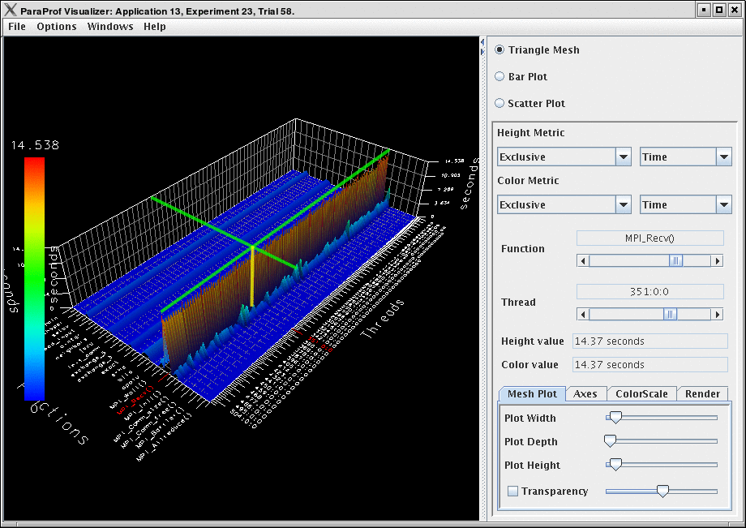
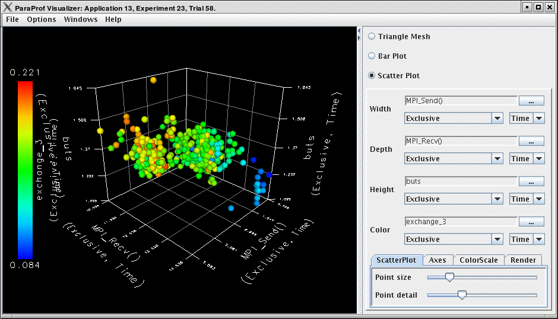
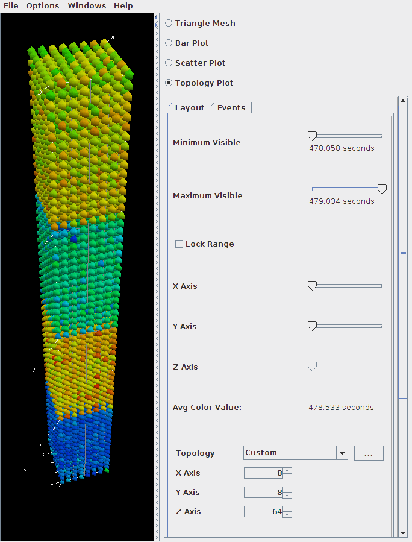
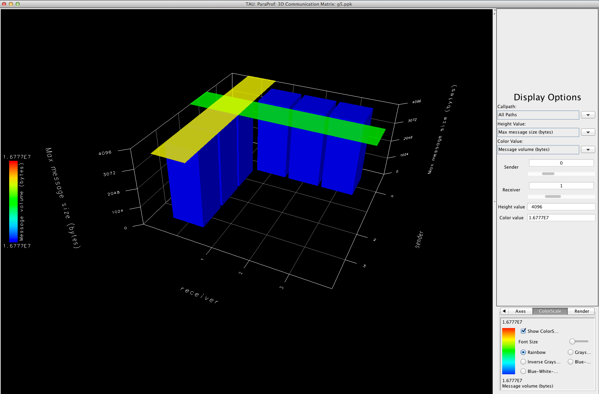

3-D Visualization
=================

ParaProf displays massive parallel profiles through the use of OpenGL
hardware acceleration through the 3D Visualization window. Each window
is fully configurable with rotation, translation, and zooming
capabilities. Rotation is accomplished by holding the left mouse button
down and dragging the mouse. Translation is done likewise with the right
mouse button. Zooming is done with the mousewheel and the + and -
keyboard buttons.

Triangle Mesh Plot
==================

|Triangle Mesh Plot|

This visualization method shows two metrics for all functions, all
threads. The height represents one chosen metric, and the color,
another. These are selected from the drop-down boxes on the right.

To pinpoint a specific value in the plot, move the *Function* and
*Thread* sliders to cycle through the available functions/threads. The
values for the two metrics, in this case for ``MPI_Recv()`` on
``Node 351``, the value is ``14.37`` seconds.

3-D Bar Plot
============

|3-D Mesh Plot|

This visualization method is similar to the triangle mesh plot. It
simply displays the data using 3d bars instead of a mesh. The controls
works the same. Note that in ? the transparency option is selected,
which changes the way in which the selection model operates.

3-D Scatter Plot
================

|3-D Scatter Plot|

This visualization method plots the value of each thread along up to 4
axes (each a different function/metric). This view allows you to discern
clustering of values and relationships between functions across threads.

Select functions using the button for each dimension, then select a
metric. A single function across 4 metrics could be used, for example.

3-D Topology Plot
=================

|3-D Topology Plot|

In this visualization, you can either define the layout with a MESP
topology definition file or you can fill a rectangular prism of
user-defined volume with rank-points in order of rank. For more
information, please see the etc/topology directory for additional
details on MESP topology definitions.

If the loaded profile is a cube file or a profile from a BGB, then this
visualizations groups the threads in two or three dimensional space
using topology information supplied by the profile.

When topology metadata is available a trial-specific topological layout
may be visualized by selecting Windows->gt;3D Visualization and
selecting Topology Plot on the visualization pane.

The layout tab allows control of the layout and display of visualized
cores/processes.

Minimum/Maximum Visible (restricts display of nodes with measured values
above/below the selected levels). Lock Range causes the sliders to move
in unison.

The X/Y/Z Axis sliders allow selection of planes, lines and individual
points in the topology for examination of specific values in the
display, listed in the Avg. Color Value field.

The topology selection dropdown box allows selection of either
trial-specific topologies contained in the metadata, mapped topologies
stored in an external file or a custom topology defined by the size of
the prism containing the visualized cores. The ... button allows
selection of a custom topology mapping file while the map button allows
selection of a map file (see <tau2>/etc/topology/README.cray\_map for
more information on generating map files).

If a Custom is selected the dimensions of the rectangular prism
containing the cores are defined by the X/Y/Z axis control widgets.

The Events tab controls which events are used to define the color values
and positions of cores/processes in the display. For trail-specific and
Custom topologies only event3(Color) can be changed. For topologies
loaded in MESP definition files all four events may be used in
calculation of the topology layout. In either case, interval, atomic or
metadata values may be used to color or position points in the display.

3-D Commication Matrix
======================

|3-D Commication Matrix|

If a Trial has commication information (set TAU\_COMM\_MATRIX=1 at
runtime of your application), then you can launch the 3D Commication
window as shown.

.. |3-D Mesh Plot| image:: 3dvew1.png

