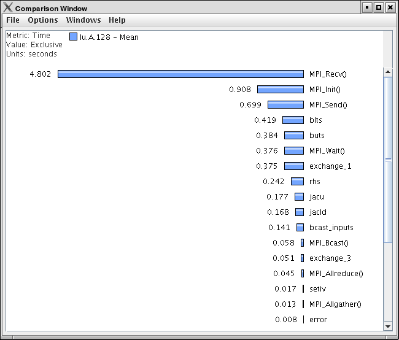
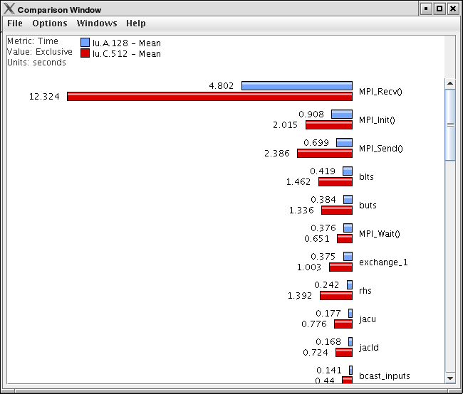
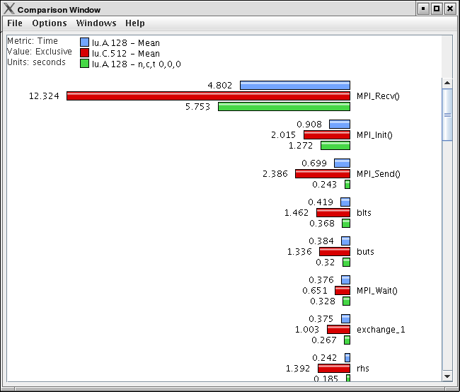

Comparative Analysis
====================

ParaProf can perform cross-thread and cross-trial anaylsis. In this way,
you can compare two or more trials and/or threads in a single display.

Using Comparitive Analysis
==========================

Comparative analysis in ParaProf is based on individual threads of
execution. There is a maximum of one Comparison window for a given
ParaProf session. To add threads to the window, right click on them and
select "Add Thread to Comparison Window". The Comparison Window will pop
up with the thread selected. Note that "mean" and "std. dev." are
considered threads for this any most other purposes.

|Comparison Window (initial)|

Add additional threads, from any trial, by the same means.

|Comparison Window (2 trials)|

|Comparison Window (3 threads)|

