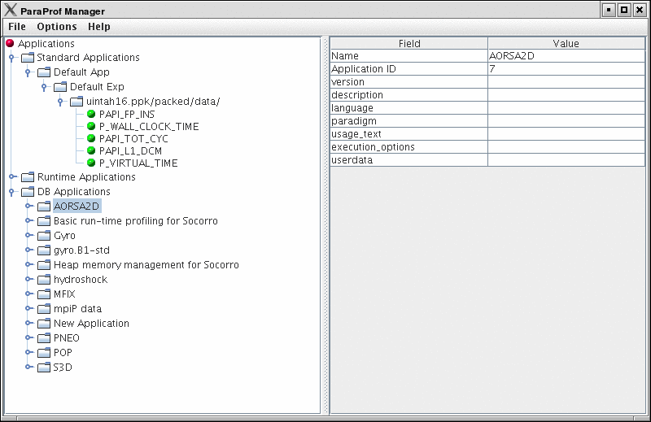
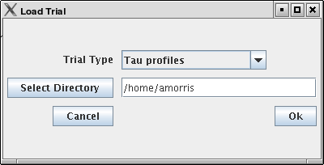
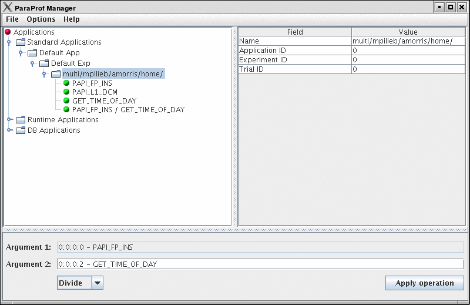
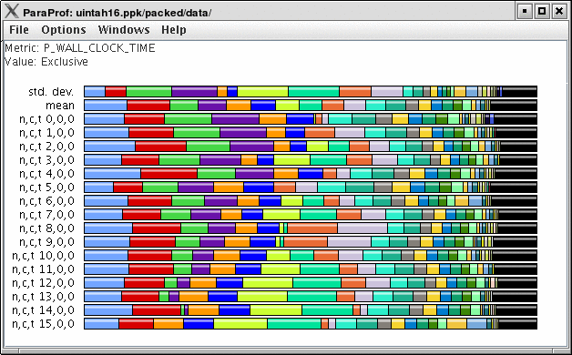
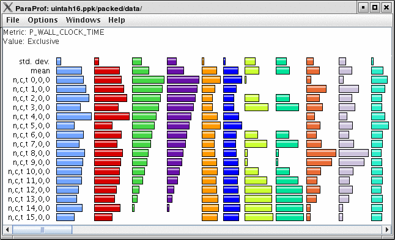

Profile Data Management
=======================

ParaProf uses PerfDMF to manage profile data. This enables it to read
the various profile formats as well as store and retrieve them from a
database.

ParaProf Manager Window
=======================

Upon launching ParaProf, the user is greeted with the ParaProf Manager
Window.

|ParaProf Manager Window|

This window is used to manage profile data. The user can upload/download
profile data, edit meta-data, launch visual displays, export data,
derive new metrics, etc.

Loading Profiles
================

To load profile data, select File->Open, or right click on the
Application's tree and select "Add Trial".

|Loading Profile Data|

Select the type of data from the "Trial Type" drop-down box. For TAU
Profiles, select a directory, for other types, files.

Database Interaction
====================

Database interaction is done through the tree view of the ParaProf
Manager Window. Applications expand to Experiments, Experiments to
Trials, and Trials are loaded directly into ParaProf just as if they
were read off disk. Additionally, the meta-data associated with each
element is show on the right, as in ?. A trial can be exported by right
clicking on it and selecting "Export as Packed Profile".

New trials can be uploaded to the database by either right-clicking on
an entity in the database and selecting "Add Trial", or by
right-clicking on an Application/Experiment/Trial hierarchy from the
"Standard Applications" and selecting "Upload
Application/Experiment/Trial to DB".

Creating Derived Metrics
========================

ParaProf can created derived metrics using the *Derived Metric Panel*,
available from the *Options* menu of the ParaProf Manager Window.

|Creating Derived Metrics|

In ?, we have just divided Floating Point Instructions by Wall-clock
time, creating FLOPS (Floating Point Operations per Second). The 2nd
argument is a user editable text-box and can be filled in with scalar
values by using the keyword 'val' (e.g. "val 1.5").

Main Data Window
================

Upon loading a profile, or double-clicking on a metric, the Main Data
Window will be displayed.

|Main Data Window|

This window shows each thread as well as statistics as a combined bar
graph. Each function is represented by a different color (though
possibly cycled). From anywhere in ParaProf, you can right-click on
objects representing threads or functions to launch displays associated
with those objects. For example, in ?, right click on the text *n,c,t,
8,0,0* to launch thread based displays for node 8.

|Unstacked Bars|

You may also turn off the stacking of bars so that individual functions
can be compared across threads in a global display.

