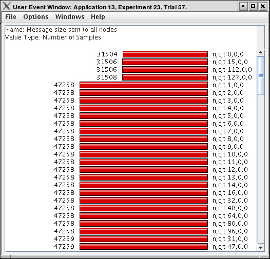
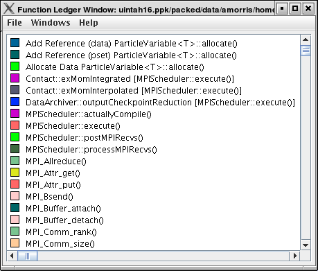
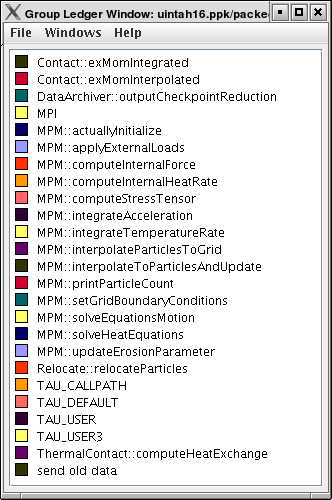
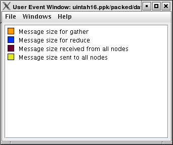
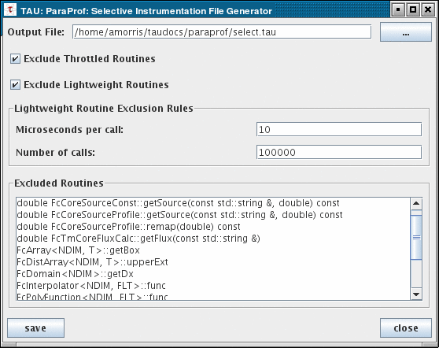

Miscellaneous Displays
======================

User Event Bar Graph
====================

In addition to displaying the text statistics for User Defined Events,
ParaProf can also graph a particular User Event across all threads.

|User Event Bar Graph|

This display graphs the value that the particular user event had for
each thread.

Ledgers
=======

ParaProf has three ledgers that show the functions, groups, and user
events.

Function Ledger
---------------

|Function Ledger|

The function ledger shows each function along with its current color. As
with other displays showing functions, you may right-click on a function
to launch other function-specific displays.

Group Ledger
------------

|Group Ledger|

The group ledger shows each group along with its current color. This
ledger is especially important because it gives you the ability to mask
all of the other displays based on group membership. For example, you
can right-click on the ``MPI`` group and select "Show This Group Only"
and all of the windows will now mask to only those functions which are
members of the ``MPI`` group. You may also mask by the inverse by
selecting "Show All Groups Except This One" to mask out a particular
group.

User Event Ledger
-----------------

|User Event Ledger|

The user event ledger shows each user event along with its current
color.

Selective Instrumentation File Generator
========================================

ParaProf can also help you refine your program performance by excluding
some functions from instrumentation. You can select rules to determine
which function get excluded; both rules must be true for a given
function to be excluded. Below each function that will be excluded based
on these rules are listed.

|Selective Instrumentation Dialog|

    **Note**

    Only the functions profilied in ParaProf can be excluded. If you had
    previously setup selective instrumentation for this application the
    functions that where previously excluded will not longer be
    excluded.

