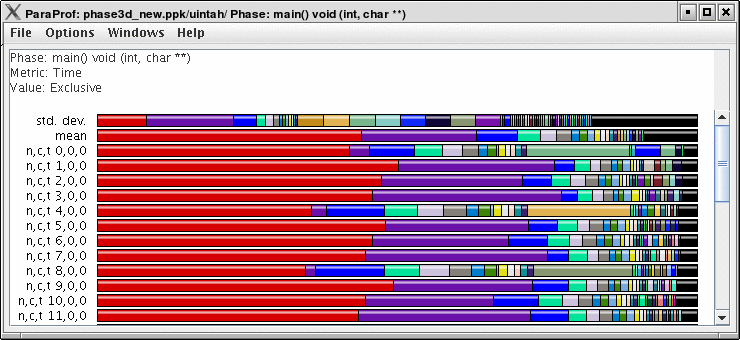
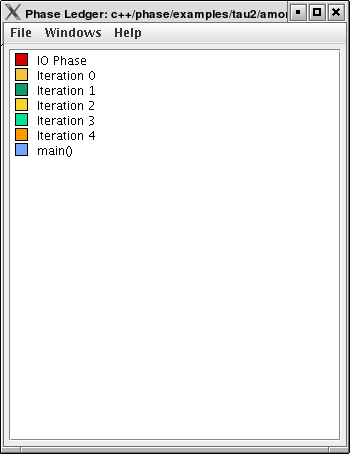
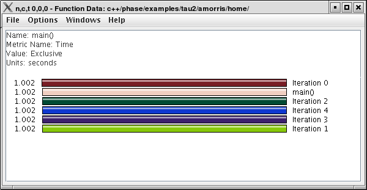

Phase Based Displays
====================

When a profile contains phase data, ParaProf will automatically run in
phase mode. Most displays will show data for a particular phase. This
phase will be displayed in teh top left corner in the meta data panel.

Using Phase Based Displays
==========================

The initial window will default to top level phase, usually *main*

|Initial Phase Display|

To access other phases, either right click on the phase and select,
"Open Profile for this Phase", or go to the *Phase Ledger* and select it
there.

|Phase Ledger|

ParaProf can also display a particular function's value across all of
the phases. To do so, right click on a function and select, "Show
Function Data over Phases".

|Function Data over Phases|

Because Phase information is implemented as callpaths, many of the
callpath displays will show phase data as well. For example, the Call
Path Text Window is useful for showing how functions behave across
phases.

