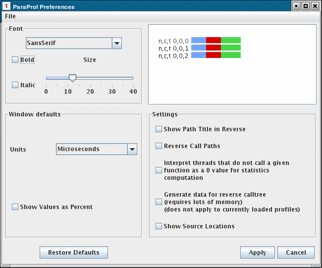
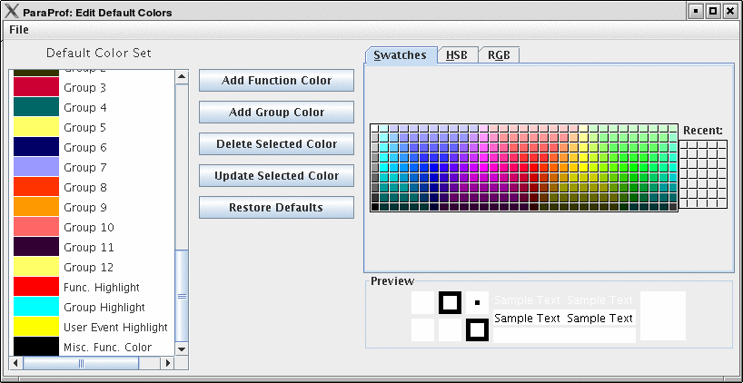
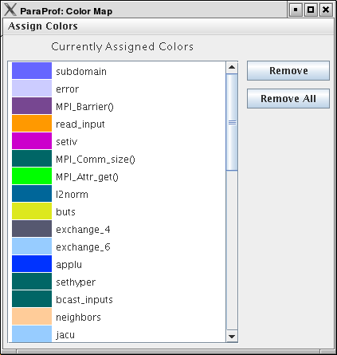

Preferences
===========

Preferences are modified from the ParaProf Preferences Window, launched
from the File menu. Preferences are saved between sessions in the
``.ParaProf/ParaProf.prefs``

Preferences Window
==================

In addition to displaying the text statistics for User Defined Events,
ParaProf can also graph a particular User Event across all threads.

|ParaProf Preferences Window|

The preferences window allows the user to modify the behavior and
display style of ParaProf's windows. The font size affects bar height, a
sample display is shown in the upper-right.

The Window defaults section will determine the initial settings for new
windows. You may change the initial units selection and whether you want
values displayed as percentages or as raw values.

The Settings section controls the following

-  Show Path Title in Reverse - Path title will normally be shown in
   normal order (/home/amorris/data/etc). They can be reverse using this
   option (etc/data/amorris/home). This only affects loaded trials and
   the titlebars of new windows.

-  Reverse Call Paths - This option will immediately change the display
   of all callpath functions between ``Root =>
           Leaf`` and ``Leaf <= Root``.

-  Statistics Computation - Turning this option on causes the mean
   computation to take the sum of value for a function across all
   threads and divide it by the total number of threads. With this
   option off the sum will only be divided by the number of threads that
   actively participated in the sum. This way the user can control
   whether or not threads which do not call a particular function are
   consider as a ``0`` in the computation of statistics.

-  Generate Reverse Calltree Data - This option will enable the
   generation of reverse callpath data necessary for the reverse
   callpath option of the statistics tree-table window.

-  Show Source Locations - This option will enable the display of source
   code locations in event names.

Default Colors
==============

|Edit Default Colors|

The default color editor changes how colors are distributed to functions
whose color has not been specifically assigned. It is accessible from
the File menu of the Preferences Window.

Color Map
=========

|Color Map|

The color map shows specifically assigned colors. These values are used
across all trials loaded so that the user can identify a particular
function across multiple trials. In order to map an entire trial's
function set, Select "Assign Defaults from ->" and select a loaded
trial.

Individual functions can be assigned a particular color by clicking on
them in any of the other ParaProf Windows.

