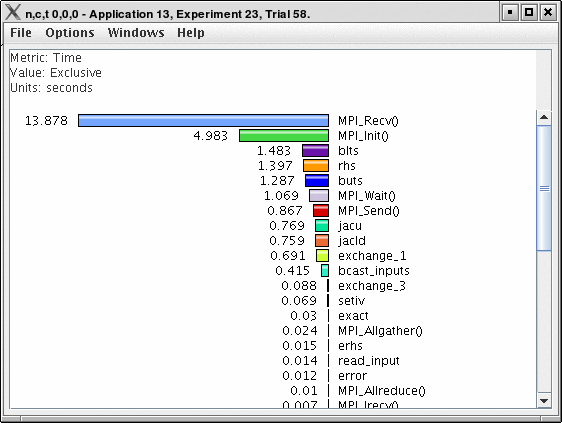
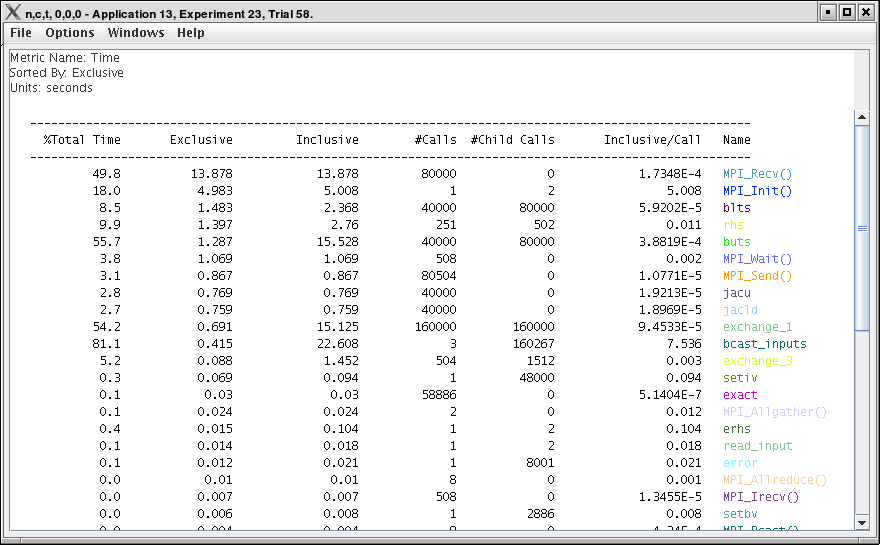
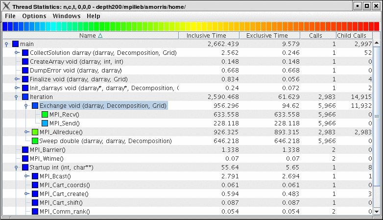
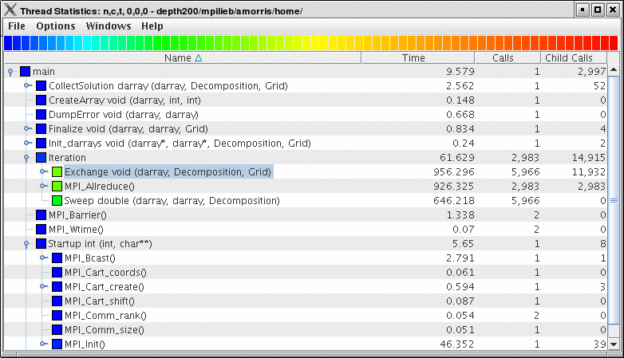
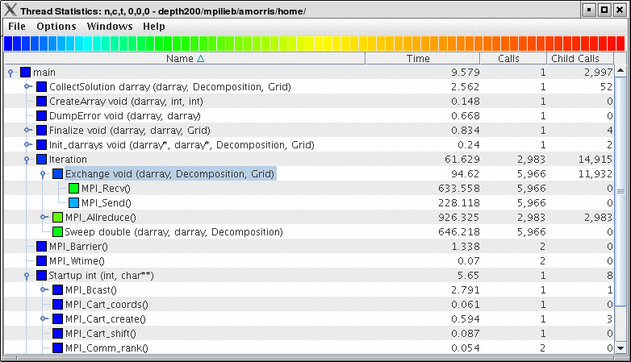
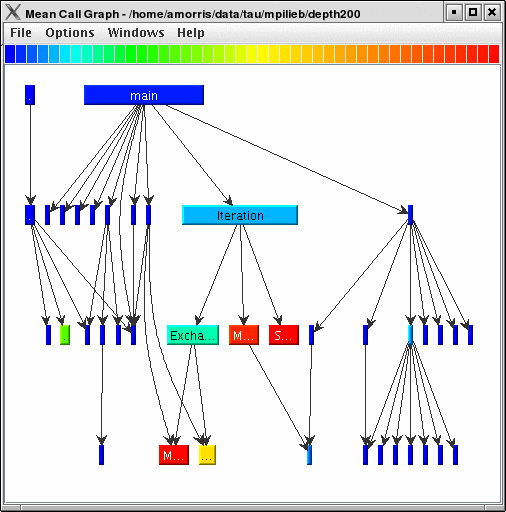
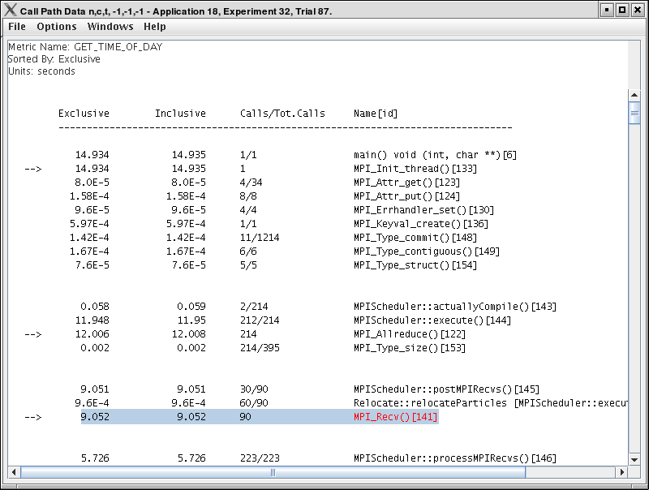
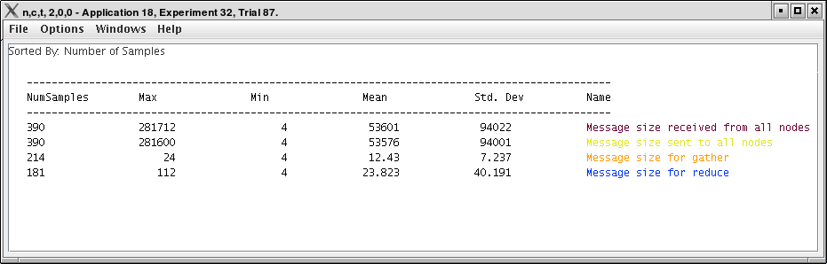
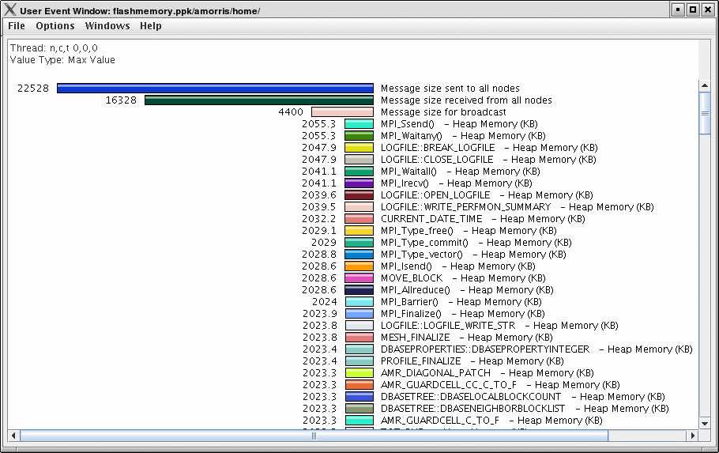

Thread Based Displays
=====================

ParaProf displays several windows that show data for one thread of
execution. In addition to per thread values, the users may also select
*mean* or *standard deviation* as the "thread" to display. In this mode,
the mean or standard deviation of the values across the threads will be
used as the value.

Thread Bar Graph
================

|Thread Bar Graph|

This display graphs each function on a particular thread for comparison.
The metric, units, and sort order can be changed from the *Options*
menu.

Thread Statistics Text Window
=============================

|Thread Statistics Text Window|

This display shows a ``pprof`` style text view of the data.

Thread Statistics Table
=======================

|Thread Statistics Table, inclusive and exclusive|

This display shows the callpath data in a table. Each callpath can be
traced from root to leaf by opening each node in the tree view. A
colorscale immediately draws attention to "hot spots", areas that
contain highest values.

|Thread Statistics Table|

|Thread Statistics Table|

The display can be used in one of two ways, in "inclusive/exclusive"
mode, both the inclusive and exclusive values are shown for each path,
see ? for an example.

When this option is off, the inclusive value for a node is show when it
is closed, and the exclusive value is shown when it is open. This allows
the user to more easily see where the time is spent since the total time
for the application will always be represented in one column. See ? and
? for examples. This display also functions as a regular statistics
table without callpath data. The data can be sorted by columns by
clicking on the column heading. When multiple metrics are available, you
can add and remove columns for the display using the menu.

Call Graph Window
=================

|Call Graph Window|

This display shows callpath data in a graph using two metrics, one
determines the width, the other the color. The full name of the function
as well as the two values (color and width) are displayed in a tooltip
when hovering over a box. By clicking on a box, the actual ancestors and
descendants for that function and their paths (arrows) will be
highlighted with blue. This allows you to see which functions are called
by which other functions since the interplay of multiple paths may
obscure it.

Thread Call Path Relations Window
=================================

|Thread Call Path Relations Window|

This display shows callpath data in a ``gprof`` style view. Each
function is shown with its immediate parents. For example, ? shows that
``MPI_Recv()`` is call from two places for a total of ``9.052`` seconds.
Most of that time comes from the 30 calls when ``MPI_Recv()`` is called
by ``MPIScheduler::postMPIRecvs()``. The other 60 calls do not amount to
much time.

User Event Statistics Window
============================

|User Event Statistics Window|

This display shows a ``pprof`` style text view of the user event data.
Right clicking on a User Event will give you the option to open a Bar
Graph for that particular User Event across all threads. See ?

User Event Thread Bar Chart
===========================

|User Event Thread Bar Chart Window|

This display shows a particular thread's user defined event statistics
as a bar chart. This is the same data from the ?, in graphical form.

