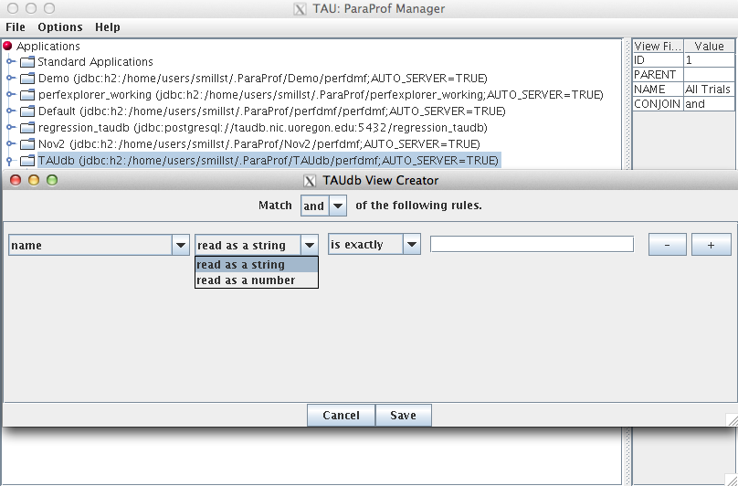

Views and Sub-Views
===================

In the past, PerfDMF used a hierarchy of Applications and Experiments to
organize Trials. This approach was too rigid, so in TAUdb, trials are
organized by dynamic Views. Views are lists of Trials that share a given
metadata value. For example, a View could contain all the Trials where
the total number of threads is less than 16. Views can also have
Sub-Views. For example, it might be useful to have a View of all Trials
from a certain machine and then Sub-Views for each executable ran on
that machine. Trials can belong to any number of VIews and Sub-Views and
new Trials loaded to the database will be sorted into Views
automatically.

To Create a (Sub-)Views
=======================

Launch ParaProf and Right click on a database or an existing View and
select "Add View" or "Add Sub-View."

|In ParaProf and PerfExplorer, Views are marked by the Folder Icon and
Trials are now marked with a yellow ball. (The "All Trials" View is
created when a database is created.)|

This will launch the View Creator window.

|View Creator Window|

Here you can create the rule(s) for which Trials appear in this new
View. At the top you can choose to match all of the rules ("and") or to
match any of the rules. The "-" or "=" buttons will remove the current
rule or add a new one. The first drop down box chooses which metadata
field to use. The second box chooses whether the field should be read as
a string or a number. Depending on whether it is read as a string or a
number, the fourth box will give options on how to compare the metadata
field. So to create a View for all trials that have less than 16
threads, select total\_threads, read as a string, is less than, 16. Then
click Save and give the View a name.

The 'Edit' context menu option on an existing view will allow you to
view and alter the view's criteria in the same interface.

.. |In ParaProf and PerfExplorer, Views are marked by the Folder Icon and Trials are now marked with a yellow ball. (The "All Trials" View is created when a database is created.)| image:: AddView.png

