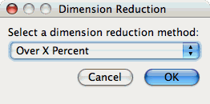
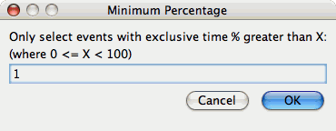
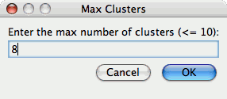
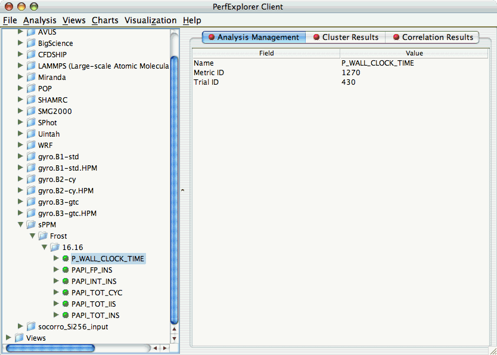
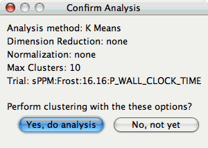
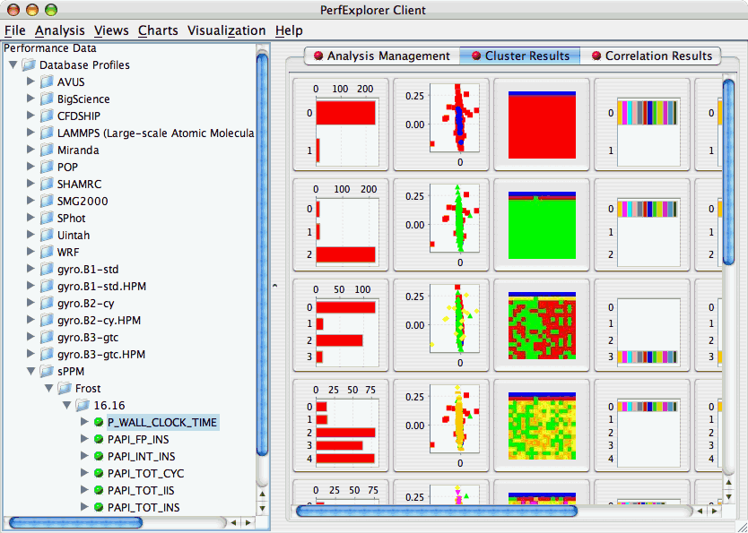
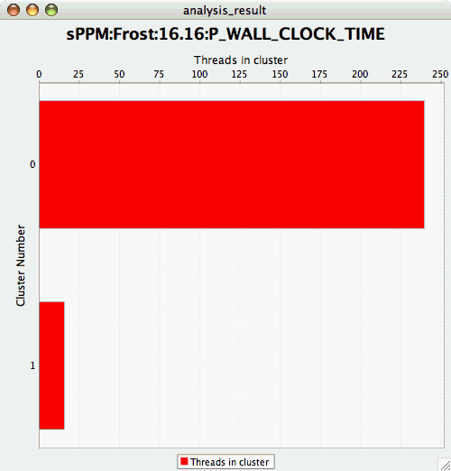
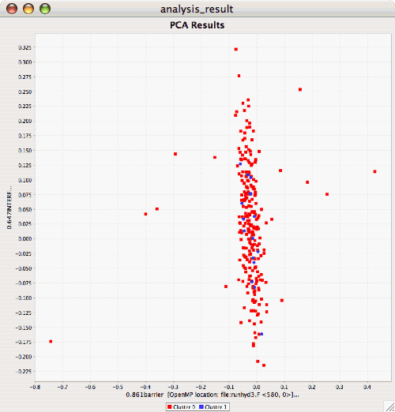
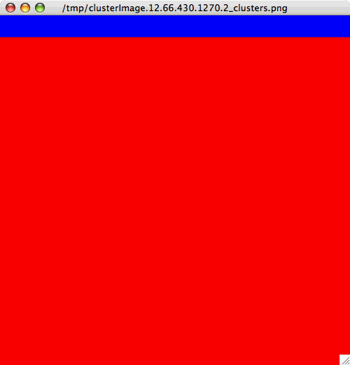
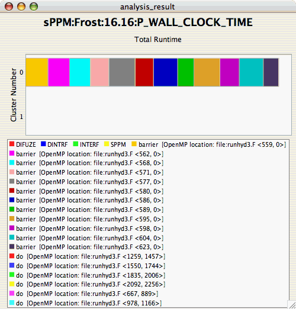

Cluster Analysis
================

Cluster analysis is a valuable tool for reducing large parallel profiles
down to representative groups for investigation. Currently, there are
two types of clustering analysis implemented in PerfExplorer. Both
*hierarchical* and *k-means* analysis are used to group parallel
profiles into common clusters, and then the clusters are summarized.
Initially, we used similarity measures computed on a single parallel
profile as input to the clustering algorithms, although other forms of
input are possible. Here, the performance data is organized into
multi-dimensional vectors for analysis. Each vector represents one
parallel thread (or process) of execution in the profile. Each dimension
in the vector represents an event that was profiled in the application.
Events can be any sub-region of code, including libraries, functions,
loops, basic blocks or even individual lines of code. In simple
clustering examples, each vector represents only one metric of
measurement. For our purposes, some dissimilarity value, such as
*Euclidean* or *Manhattan* distance, is computed on the vectors. As
discussed later, we have tested hierarchical and $k$-means cluster
analysis in PerfExplorer on profiles with over 32K threads of execution
with few difficulties.

Dimension Reduction
===================

Often, many hundreds of events are instrumented when profile data is
collected. Clustering works best with dimensions less than 10, so
dimension reduction is often necessary to get meaningful results.
Currently, there is only one type of dimension reduction available in
PerfExplorer. To reduce dimensions, the user specifies a minimum
exclusive percentage for an event to be considered "significant".

To reduce dimensions, select the "Select Dimension Reduction" item under
the "Analysis" main menu bar item. The following dialog will appear:

|Selecting a dimension reduction method|

Select "Over X Percent". The following dialog will appear:

|Entering a minimum threshold for exclusive percentage|

Enter a value, for example "1".

Max Number of Clusters
======================

By default, PerfExplorer will attempt k-means clustering with values of
k from 2 to 10. To change the maximum number of clusters, select the
"Set Maximum Number of Clusters" item under the "Analysis" main menu
item. The following dialog will appear:

|Entering a maximum number of clusters|

Performing Cluster Analysis
===========================

To perform cluster analysis, you first need to select a metric. To
select a metric, navigate through the tree of applications, experiments
and trials, and expand the trial of interest, showing the available
metrics, as shown in the figure below:

|Selecting a Metric to Cluster|

After selecting the metric of interest, select the "Do Clustering" item
under the "Analysis" main menu bar item. The following dialog will
appear:

|Confirm Clustering Options|

After confirming the clustering, the clustering will begin. When the
clustering results are available, you can view them in the "Cluster
Results" tab.

|Cluster Results|

There are a number of images in the "Cluster Results" window. From left
to right, the windows indicate the cluster membership histogram, a PCA
scatterplot showing the cluster memberships, a virtual topology of the
parallel machine, the minimum values for each event in each cluster, the
average values for each event in each cluster, and the maximum values
for each event in each cluster. Clicking on a thumbnail image in the
main window will bring up the images, as shown below:

|Cluster Membership Histogram|

|Cluster Membership Scatterplot|

|Cluster Virtual Topology|

|Cluster Average Behavior|

