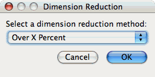
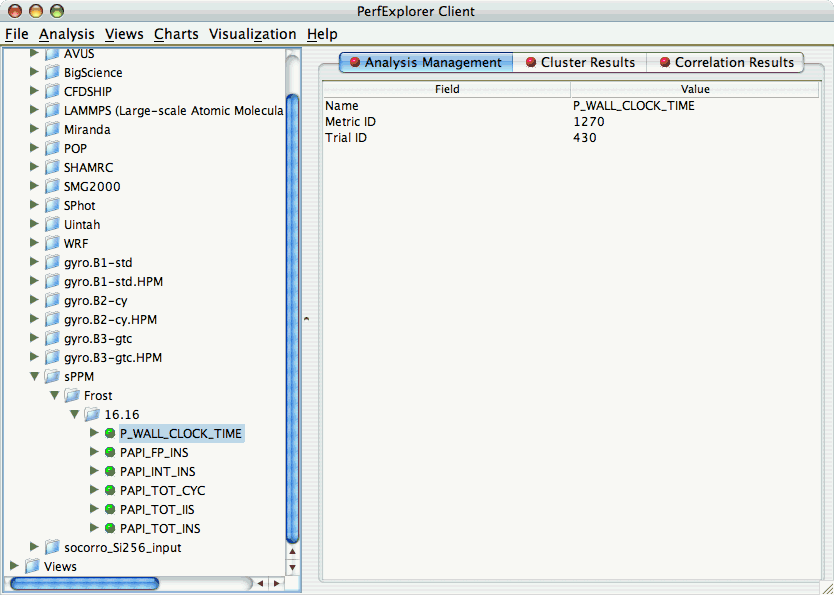
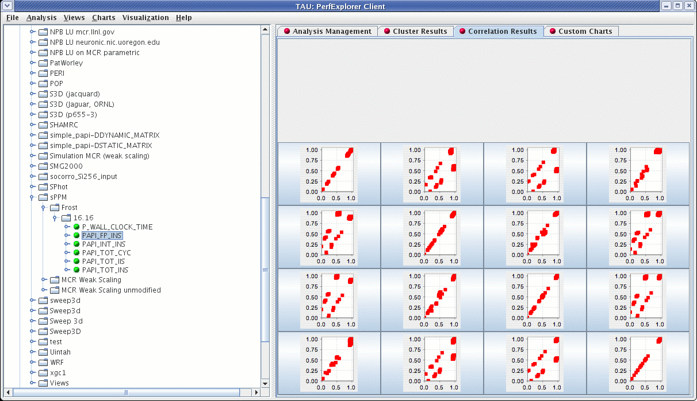
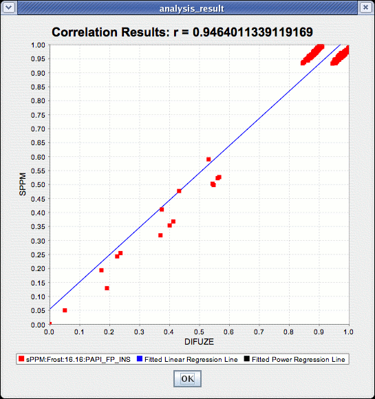

Correlation Analysis
====================

Correlation analysis in PerfExplorer is used to explore relationships
between events in a profile. Each event is pairwise plotted with the
other events, and a correlation coefficient is calcuated for the
relationship. When the events are highly positively correlated
(coefficient of close to 1.0) or highly negatively correlated
(coefficient close to -1.0), then the relationships will show up as
linear groupings in the results. Clusters may also be apparent.

Dimension Reduction
===================

Often, many hundreds of events are instrumented when profile data is
collected. Clustering works best with dimensions less than 10, so
dimension reduction is often necessary to get meaningful results.
Currently, there is only one type of dimension reduction available in
PerfExplorer. To reduce dimensions, the user specifies a minimum
exclusive percentage for an event to be considered "significant".

To reduce dimensions, select the "Select Dimension Reduction" item under
the "Analysis" main menu bar item. The following dialog will appear:

|Selecting a dimension reduction method|

Select "Over X Percent". The following dialog will appear:

|Entering a minimum threshold for exclusive percentage|

Enter a value, for example "1".

Performing Correlation Analysis
===============================

To perform correlation analysis, you first need to select a metric. To
select a metric, navigate through the tree of applications, experiments
and trials, and expand the trial of interest, showing the available
metrics, as shown in the figure below:

|Selecting a Metric to Cluster|

After selecting the metric of interest, select the "Do Correlation
Analysis" item under the "Analysis" main menu bar item. A confirmation
dialog will appear, and you can either confirm the correlation request
or cancel it. After confirming the correlation, the analysis will begin.
When the analysis results are available, you can view them in the
"Correlation Results" tab.

|Correlation Results|

There are a number of images in the "Correlation Results" window. Each
thumbnail represents a pairwise correlation plot of two events. Clicking
on a thumbnail image in the main window will bring up the images, as
shown below:

|Correlation Example|

.. |Entering a minimum threshold for exclusive percentage| image:: dimensionreduction2.gif

