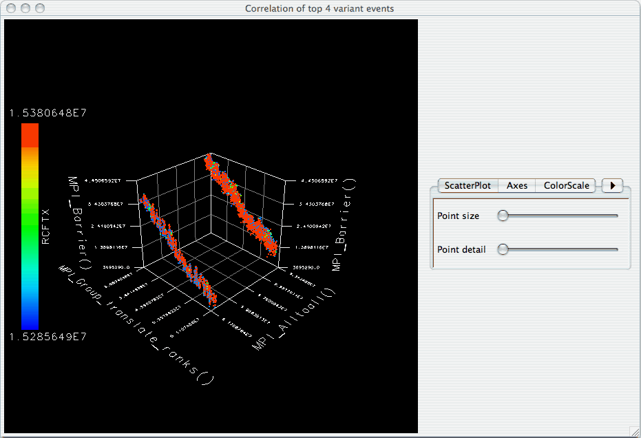
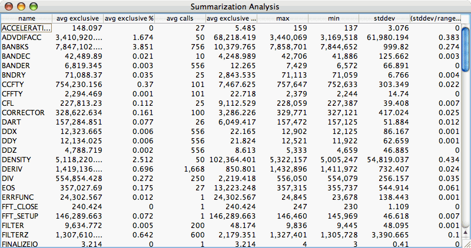
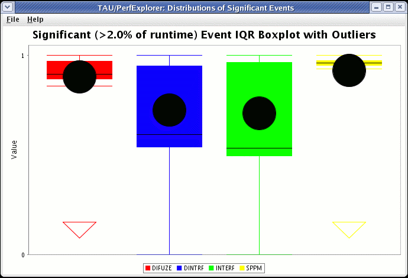
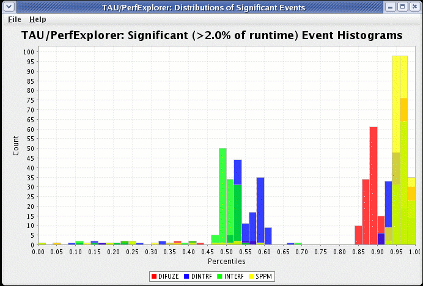
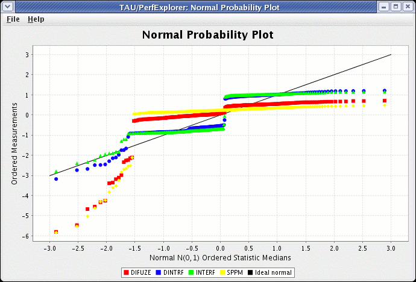

Visualization
=============

Under the "Visualization" main menu item, there are five types of raw
data visualization. The five items are "3D Visualization", "Data
Summary", "Create Boxchart", "Create Histogram" and "Create Normal
Probability Chart". For the Boxchart, Histogram and Normal Probability
Charts, you can either select one metric in the trial (which selects all
events by default), or expand the metric and select events of interest.

3D Visualization
================

When the "3D Visualization" is requested, PerfExplorer examines the data
to try to determine the most interesting events in the trial. That is,
for the selected metric in the selected trial, the database will
calculate the weighted relative variance for each event across all
threads of execution, in order to find the top four "significant"
events. These events are selected by calculating: stddev(exclusive) /
(max(exclusive) - min(exclusive)) \* exclusive\_percentage. After
selecting the top four events, they are graphed in an OpenGL window.

|3D Visualization of multivariate data|

Data Summary
============

In order to see a summary of the performance data in the database,
select the "Show Data Summary" item under the "Visualization" main menu
item.

|Data Summary Window|

Creating a Boxchart
===================

In order to see a boxchart summary of the performance data in the
database, select the "Create Boxchart" item under the "Visualization"
main menu item.

|Boxchart|

Creating a Histogram
====================

In order to see a histogram summary of the performance data in the
database, select the "Create Histogram" item under the "Visualization"
main menu item.

|Histogram|

Creating a Normal Probability Chart
===================================

In order to see a normal probability summary of the performance data in
the database, select the "Create NormalProbability" item under the
"Visualization" main menu item.

|Normal Probability|

