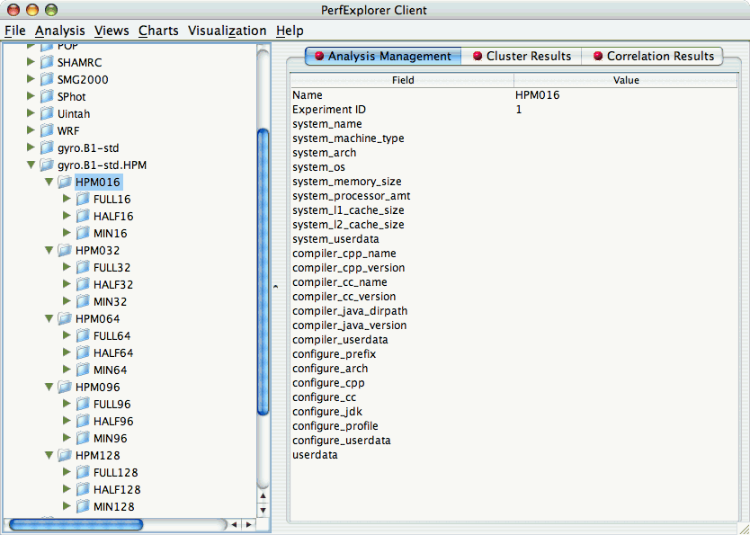
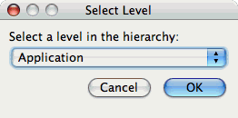
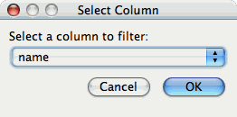
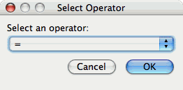
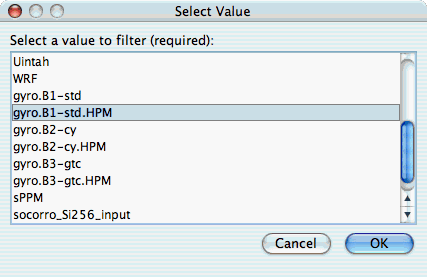
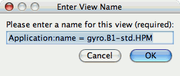
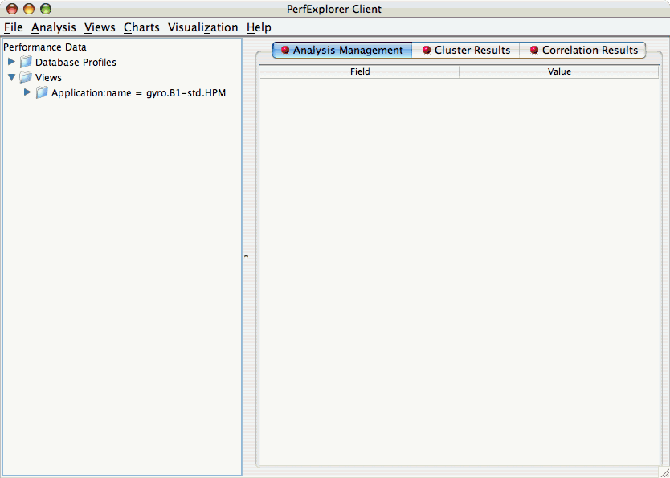
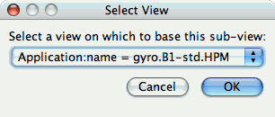
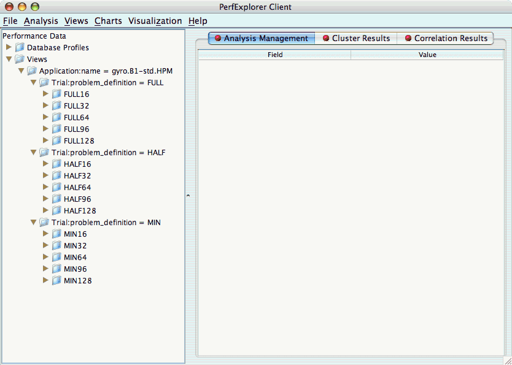

Views
=====

Often times, data is loaded into the database with multiple parametric
cross-sections. For example, the charts available in PerfExplorer are
primarily designed for scalability analysis, however data might be
loaded as a parametric study. For example, in the following example, the
data has been loaded with three problem sizes, MIN, HALF and FULL.

|Potential scalability data organized as a parametric study|

In order to examine this data in a scalability study, it is necessary to
reorganize the data. However, it is not necessary to re-load the data.
Using views in PerfExplorer, you can re-organize the data based on
values in the database.

Creating Views
==============

To create a view, select the "Create New View" item under the "Views"
main menu item. The first step is to select the table which will form
the basis of the view. The three possible values are Application,
Experiment and Trial:

|Selecting a table|

After selecting the table, you need to select the column on which to
filter:

|Selecting a column|

After selecting the column, you need to select the operator for
comparing to that column:

|Selecting an operator|

After selecting the operator, you need to select the value for comparing
to the column:

|Selecting a value|

After selecting the value, you need to select a name for the view:

|Entering a name for the view|

After creating the view, you will need to exit PerfExplorer and re-start
it to see the view. This is a known problem with the application, and
will be fixed in a future release.

|The completed view|

Creating Subviews
=================

In order to create sub-views, you first need to select the "Create New
Sub-View" item from the "Views" main menu item. The first dialog box
will prompt you to select the view (or sub-view) to base the new
sub-view on:

|Selecting the base view|

After selecting the base view or sub-view, the options for creating the
new sub-view are the same as creating a new view. After creating the
sub-view, you will need to exit PerfExplorer and re-start it to see the
sub-view. This is a known problem with the application, and will be
fixed in a future release.

|Completed sub-views|

