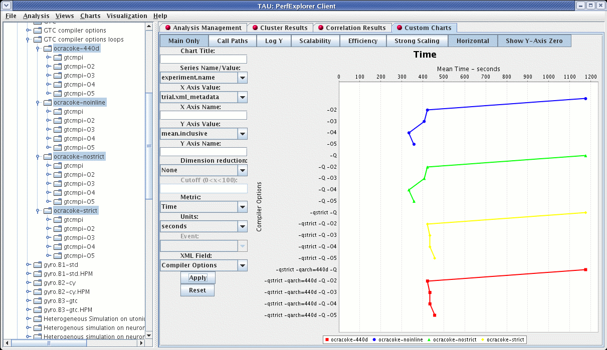

Custom Charts
=============

In addition to the default charts available in the charts menu, there
are is a custom chart interface. To access the interface, select the
"Custom Charts" tab on in the results pane of the main window, as shown:

|The Custom Charts Interface|

There are a number of controls for the cusotom charts. They are:

-  Main Only - When selected, only the main event (the event with the
   highest inclusive value) will be selected. When deselected, the
   "Events" control (see below) is activated, and one or all events can
   be selected.

-  Call Paths - When selected, callpath events will be available in the
   "Events" control (see below).

-  Log Y - When selected, the Y axis will be the log of the true value.

-  Scalability - When selected, the chart will be interpreted as a
   speedup chart. The trial with the fewest number of threads of
   execution will be considered the baseline trial.

-  Efficiency - When selected, the chart will be interpreted as a
   relative efficiency chart. The trial with the fewest number of
   threads of execution will be considered the baseline trial.

-  Strong Scaling - When deselected, the speedup or efficiency chart
   will be interpreted as a strong scaling study (the workload is the
   same for all trials). When selected, the button will change to "Weak
   Scaling", and the chart will be interpreted as a weak scaling study
   (the workload is proportional to the total number of threads in each
   trial).

-  Horizontal - when selected, the chart X and Y axes will be swapped.

-  Show Y-Axis Zero - when selected, the chart will include the value 0.
   When deselected, the chart will only show the relevant values for all
   data points.

-  Chart Title - value to use for the chart title

-  Series Name/Value - the field to be used to group the data points as
   a series.

-  X Axis Value - the field to use as the X axis value.

-  X Axis Name - the name to put in the chart for the value along the X
   axis.

-  Y Axis Value - the field to use as the Y axis value

-  Y Axis Name - the name to put in the chart for the value along the X
   axis.

-  Dimension Reduction - whether or not to use dimension reduction. This
   is only applicable when "Main Only" is disabled.

-  Cutoff - when the "Dimension Reduction" is enabled, the cutoff value
   for selecting "All Events".

-  Metric - The metric of interest for the Y axis.

-  Units - The unit to be selected for the Y axis.

-  Event - The event of interest, or "All Events".

-  XML Field - When the X or Y axis is selected to be an XML field, this
   is the field of interest.

-  Apply - build the chart.

-  Reset - restore the options back to the default values.

When the chart is generated, it can be saved as a vector image by
selecting "File -> Save As Vector Image". The chart can also be saved as
a PNG by right clicking on the chart, and selecting "Save As...".

