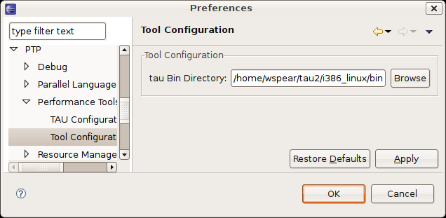
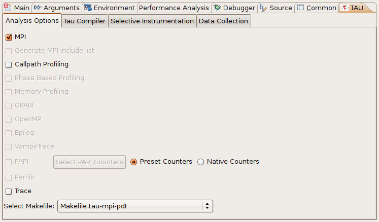
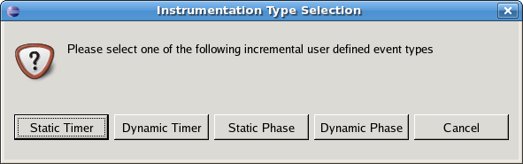
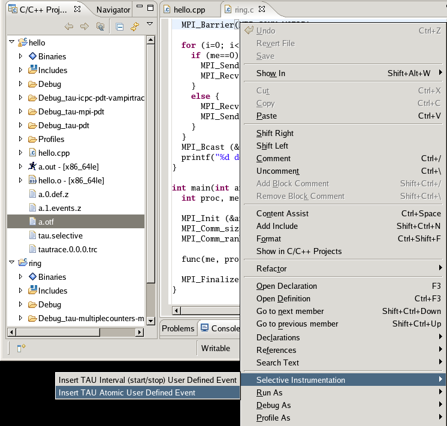

Eclipse PTP / CDT plug-in System
================================

Installation
============

Be certain that the
`PTP <http://www.eclipse.org/ptp/downloads.php>`__/`CDT <http://www.eclipse.org/cdt/downloads.php>`__/`Photran <http://www.eclipse.org/photran/download.php>`__
plug-ins are installed and running properly in your eclipse
installation. Use Tau's perfdmf\_configure utility to set up a
performance database for Eclipse to store profile output.

Run the install\_plug-ins.sh script located in ``[tau
installation]/tools/src/eclipse`` with the location of your eclipse
installation. e.g: ``~/tau2/tools/src/eclipse/install_plug-ins.sh
/opt/eclipse``

Restart eclipse with the -clean flag after installing the plugins.

    **Note**

    By default Eclipse will detect the presence of TAU on your system
    and configure itself appropriately so long as the TAU bin directory
    is in your path. Only if this fails will you need to setup the TAU
    preferences manually.

In eclipse go to the Window menu, select Preferences and go to the
Performance Tools preferences section and the Tool Configuration
subsection. If the PTP is available the Performance Tools section will
be under the PTP menu. Enter the location of the desired TAU bin
directory in your in the tau Bin Directory field.

|TAU Setup|

Creating a Tau Launch Configuration
===================================

To create a TAU launch configuration, click the profile button added
near the run and debug buttons. This will provide an interface for
launching either a standard or parallel C, C++ or Fortran application,
similar to the interface provided by the standard run configuration
dialog. You may select a pre-existing run configuration or create a new
one in the usual way.

|TAU Launch Configuration|

The run configuration options are equivalent to those of a standard run
configuration, with the addition of a performance analysis tab a
parametric study tab and a TAU tab. To run an application with TAU first
make sure that the TAU option is selected in the drop down box on the
performance analysis tab. You may also specify that a Tau instrumented
executable should not be run after it is built. This option will leave a
new TAU specific build configuration available for your use. It will
have the name of the original build configuration, with the tau
configuration options used appended. The executables available in such
build configurations can be run through the standard run and debug
launch configurations. This option can be useful if you need to launch
Tau instrumented binaries outside of eclipse. There is also an option to
select existing performance data. This will upload data specified on the
filesystem to a selected database, rather than generating the data from
a project in Eclipse.

On the TAU tab you must select a Tau makefile from the available
makefiles in the Tau architecture directory you specified. You may
select specific configuration options to narrow the list of makefiles in
the dropdown box. Only makefiles configured with the ``-pdt`` option
will be listed. Additional Tau compiler options are provided on the Tau
Compiler sub-tab.

If you select a makefile with the PAPI counter library and
``-MULTIPLECOUNTERS`` enabled you may specify the PAPI environment
variables using the Select PAPI Counters button. The counters you select
will be placed in the environment variables list for your run
configuration.

You may specify the use of TAU selective instrumentation either by
selecting a pre-defined selective instrumentation file, by selecting the
internal option to have Tau to use a file generated by the selective
instrumentation commands available in the Eclipse workspace or by
selecting the automatic option to have eclipse generate a selective
instrumentation file using TAU's tau\_reduce utility. Note that the
automatic option will cause your project to be rebuilt and run twice.

By default TAU profile data will only be stored in a perfdmf database,
if available. The database may be selected on the Data Collection
sub-tab. You may specify that performance data should be kept on the
file-system with the Keep Profiles option.

If you wish to collect the resulting profile data on `TAU's online
Portal <http://tau.nic.uoregon.edu>`__, check the "Upload profile data
to TAU Portal" box. After the profiling has finished you will be
prompted to provide your user name, password and specify the destination
workspace. To view the profile data log on to the portal and select the
specified workspace.

Selective Instrumentation
=========================

C, C++ and Fortran programs have several selective instrumentation
options in Eclipse. The selective instrumentation sub-menu of the right
click menu provided by C/C++ and Fortran projects, source files and
routines in the C/C++ and program outline views allows inclusion,
exclusion and loop level instrumentation to be specified for each of
these objects. You may also clear instrumentation specified for each of
these levels from the selective instrumentation menu.

The source editor's context menu allows the insertion of interval and
atomic user defined events. To specify an atomic user defined event,
place the cursor on the line where you want the event to trigger, right
click, go to the Selective Instrumentation sub-menu and select Insert
TAU Atomic User Defined Event. Put the name you wish to associate with
the event in the first context window that appears. Put either a numeric
constant or the name of a valid numeric variable in the second window.

|Optional User Defined Events|

To specify an interval based user defined event, select the source code
you wish to be included in the interval, right click, go to the
Selective Instrumentation sub-menu and select Insert TAU Interval
(start/stop) User Defined Event. You may select use of a Static Timer,
Dynamic Timer, Static Phase or Dynamic Phase event. Note that to get
phase data you must select a Tau makefile configured with the
``-PROFILEPHASE`` option. Once you have selected the event type you will
be prompted to enter a name for the event.

|Adding User Defined Events|

All selective instrumentation options are placed in the tau.selective
file in your project's main directory. This file is automatically
employed when the Tau launch configuration has "internal" selective
instrumentation selected. You may safely edit this file manually so long
as it remains a valid Tau selective instrumentation file.

Launching a Program and Collecting Data
=======================================

To launch your project with Tau either select the Profile button from
the profile launch configuration window, select your launch
configuration from the dropdown menu of the profile button or, if your
desired configuration is already selected, simply click on the profile
button.

If a perfdmf database is configured and available, Tau profile data will
be saved there. Trace data and other performance data output will be
stored in your project's top level directory. If a perfdmf database is
not available or you have selected to save profile data on the file
system profile output will appear in a Profiles directory in your
project's top level directory. Profiles are organized in sub-directories
by the Tau configuration options used to generate them and the
time-stamp of their creation.

