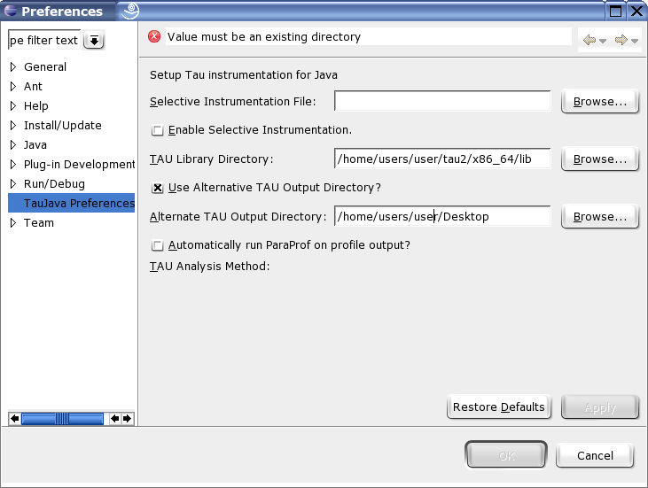
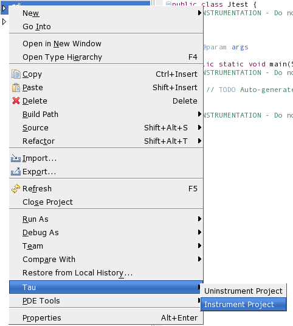
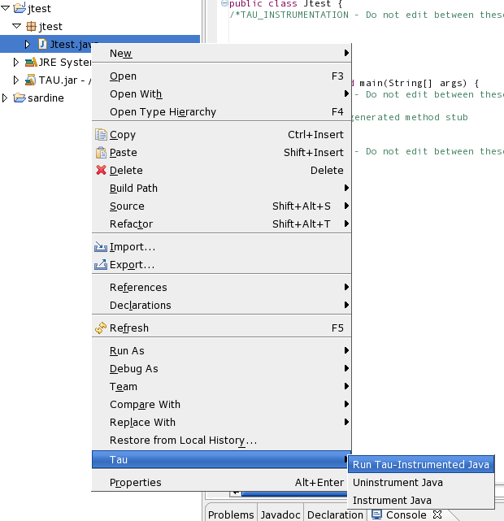

Eclipse Tau Java System
=======================

Installation
============

Copy the plugins directory in the tau2/tools/src/taujava directory to
the location of your eclipse installation. You may have to restart
eclipse if it is running when this is done.

In eclipse go to the Window menu, select Preferences and go to the
TauJava Preferences section. Enter the location of the lib directory in
the tau installation for your architecture in the Tau Library Directory
field. Other options may also be selected at this time.

|TAUJava Options Screen|

Instrumentation
===============

Java programs can be instrumented at the level of full Java projects,
packages or individual Java files. From within the Java view simply
right click on the element in the package explorer that you wish to
instrument select the Tau pop up menu and click on Instrument Project,
Package or Java respectively.

|TAUJava Project Instrumentation|

Note that the instrumenter will add the TAU.jar file to the project's
class-path the first time any element is instrumented.

Do not perform multiple instrumentations of the same Java file. Do not
edit the comments added by the instrumenter or adjust the white space
around them. Doing so may prevent the uninstrumenter from working
properly.

Uninstrumentation
=================

Uninstrumenting a Java project, package or file works just like
instrumenting. Just select the uninstrument option instead. Note that
the uninstrumenter only removes TAU instrumentation as formatted and
commented by the instrumenter. Running the uninstrumenter on code with
no TAU instrumentation present has no effect.

Running Java with TAU
=====================

To automatically analyze your instrumented project on a Unix-based
system TAU must first be configured with the -JDK option, and any other
options you want applied to your trace output. On windows the type of
analysis to be conducted, Profile, Call path or Trace, should be
selected from the Window, Preferences TauJava Preferences menu.

Once that has been accomplished, right click on the Java file containing
the main method you want to run, go to the TAU menu and click on Run
Tau-Instrumented Java. The program will run and, by default, the profile
and/or trace files will be placed in a timestamped directory, inside a
directory indicating the name of the file that was run, in the
TAU\_Output directory in the home directory of the Java project.

|TAUJava Running|

Options
=======

The following options are accessible from the Window, Preferences
TAUJava Preferences menu.

Use Alternative TAU Output Directory: Causes the TAU\_Output directory
to be placed in the location specified in the associated field. The
internal directory structure of the TAU\_Output directory remains
unchanged.

Automatically run ParaProf on profile output?: Causes the TAU profile
viewer, paraprof, to run on the output of profile and call-path analysis
output as soon as the trace files have been produced.

Enable selective instrumentation: Causes Java elements specified in the
given selection file to be included or excluded from instrumentation. By
default all packages files and methods are included. The file should
conform to the TAU file selection format described here.

::

    # Any line beginning with a # is a comment and will be disregarded.
    #
    # If an entry is both included and excluded inclusion will take precedence. 
    #
    # Entries in INCLUDE or EXCLUDE lists may use * as a wildcard character.
    #
    # If an EXCLUDE_LIST is specified, the methods in the list will not be
    # instrumented.
    #
    BEGIN_EXCLUDE_LIST
    *main*
    END_EXCLUDE_LIST
    #
    # If an INCLUDE_LIST is specified, only the methods in the list will be
    # instrumented.
    #
    BEGIN_INCLUDE_LIST
    *get*
    *set*
    END_INCLUDE_LIST
    #
    # TAU also accepts FILE_INCLUDE/EXCLUDE lists.  These may be specified with
    # the wildcard character # to exclude/include multiple files.
    # These options may be used in conjunction with the routine INCLUDE/EXCLUDE
    # lists as shown above. 
    #
    BEGIN_FILE_INCLUDE_LIST
    foo.java
    hello#.java
    END_FILE_INCLUDE_LIST
    #
    BEGIN_FILE_EXCLUDE_LIST
    bar.java
    END_FILE_EXCLUDE_LIST
    # Note that the order of the individual sections does not matter
    # and not all of the sections need to be included.  Each section
    # must be closed.

