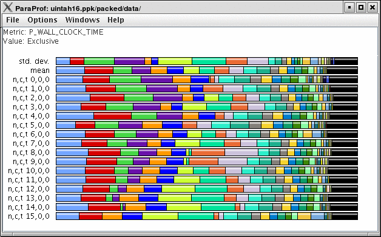

Analyzing Parallel Applications
===============================

Text summary
============

For a quick view summary of TAU performance, use ``pprof`` It reads and
prints a summary of the TAU data in the current directory. For
performance data with multiple metrics, move into one of the directories
to get information about that metric:

::

    %> cd MULTI__P_WALL_CLOCK_TIME
    %> pprof
    Reading Profile files in profile.*

    NODE 0;CONTEXT 0;THREAD 0: 
    --------------------------------------------------------------------------------------- 
    %Time    Exclusive    Inclusive       #Call      #Subrs  Inclusive Name 
                  msec   total msec                          usec/call  
    --------------------------------------------------------------------------------------- 
    100.0           24          590           1           1     590963 main 
     95.9           26          566           1           2     566911 multiply 
     47.3          279          279           1           0     279280 multiply-opt 
     44.1          260          260           1           0     260860 multiply-regular 
     

ParaProf
========

To launch ParaProf, execute paraprof from the command line where the
profiles are located. Launching ParaProf will bring up the manager
window and a window displaying the profile data as shown below.

|Main Data Window|

For more information see the `ParaProf section in the reference
guide <#ParaProfDoc>`__.

Jumpshot
========

To use Argonne's Jumpshot (bundled with TAU), first merge and convert
TAU traces to slog2 format:

::

     
    % tau_treemerge.pl 
    % tau2slog2 tau.trc tau.edf -o tau.slog2 
    % jumpshot tau.slog2 

Launching Jumpshot will bring up the main display window showing the
entire trace, zoom in to see more detail.

|Main Data Window|

